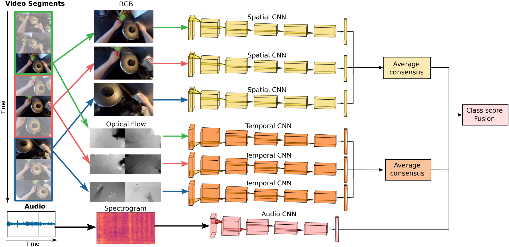

# Action Recognition on Epic Kitchens challenge

This repository contains the code used in the paper [
Seeing and Hearing Egocentric Actions: How Much Can We Learn?](http://openaccess.thecvf.com/content_ICCVW_2019/papers/EPIC/Cartas_Seeing_and_Hearing_Egocentric_Actions_How_Much_Can_We_Learn_ICCVW_2019_paper.pdf)

<center></img></center>

If you use this code or its database, please consider citing:

	@InProceedings{Cartas_2019_ICCV,
		Author = {Alejandro Cartas and Jordi Luque and
			       Petia Radeva and Carlos Segura and Mariella Dimiccoli},
	    Title = {Seeing and Hearing Egocentric Actions: How Much Can We Learn?},
	    Booktitle = {The IEEE International Conference on Computer Vision (ICCV) Workshops},
	    Month = {Oct},
	    Year = {2019}
	} 

	@misc{1906.00634,
		Author = {Alejandro Cartas and Jordi Luque and
			       Petia Radeva and Carlos Segura and Mariella Dimiccoli},
		Title = {How Much Does Audio Matter to Recognize Egocentric Object Interactions?},
		Year = {2019},
		Eprint = {arXiv:1906.00634},
	}

### Contents
1. [Installation](#installation)
1. [Preprocessing](#preprocessing)

### Installation

1. Clone this repository
  	```bash
  	git clone --recursive https://github.com/gorayni/seeing_and_hearing
  	```

2. Create the Conda environment:
	```bash
	conda create -n epic_torch python=3.6 anaconda
	conda install -n epic_torch -c anaconda pip
	conda install -n epic_torch scikit-learn
	conda install -n epic_torch -c conda-forge addict easydict jq librosa 
	conda install -n epic_torch pytorch torchvision cudatoolkit=9.0 -c pytorch
	conda activate epic_torch
	pip install gulpio telegram-send
	```

### Preprocessing

We trained our model on [EPIC Kitchens Challenge](https://epic-kitchens.github.io) dataset:

1. Download the EPIC Kitchens Challenge dataset at [https://epic-kitchens.github.io/2018](https://epic-kitchens.github.io/2018#downloads).

2. In order to use the dataset, the RGB and optical flows frames need to be [gulped](https://github.com/TwentyBN/GulpIO) and the spectrograms extracted from the video. Please follow the [preprocessing steps](https://github.com/gorayni/epic_challenge/tree/master/preprocessing).

### Training

### Audio Network

```bash
python audio_main.py conf/audio_args.json
```

### Video Temporal Segments Network

```bash
python tsn_main.py conf/tsn_rgb_args.json
```
## Testing

### Audio Network

```bash
python test_epic_challenge_audio.py conf/audio_args.json
```

### Video Temporal Segments Network

```bash
python tsn_test_main.py conf/tsn_rgb_args.json
```
